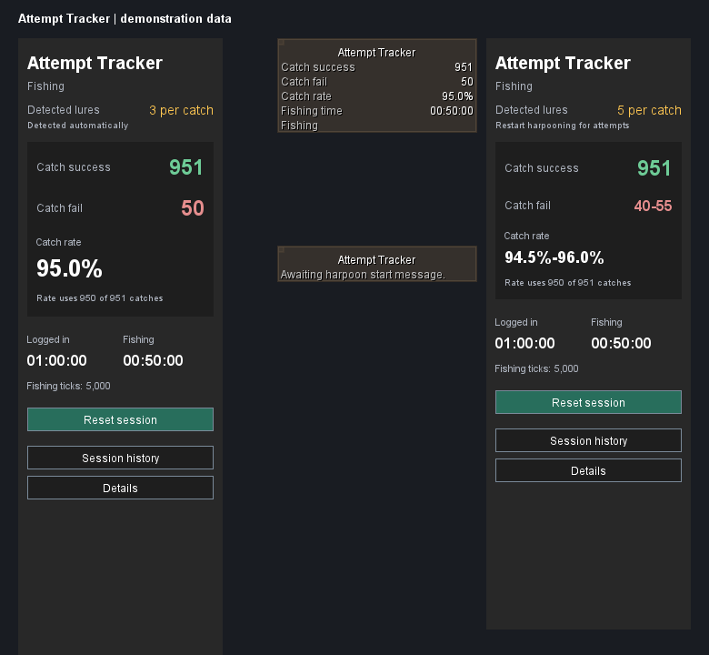

# Attempt Tracker

Track fishing catches, estimated failures, catch rate, and session time.

The sidebar shows **Catch success**, **Catch fail**, **Catch rate**, **Detected lures**, logged-in time, and active fishing time. It detects the in-game 1, 3, or 5 shark-lure setting automatically. Sessions survive logout and client restarts; **Reset session** archives the current session and starts a new one.

## Install

The Plugin Hub submission is in progress. Once RuneLite maintainers approve and merge it, open **Plugin Hub**, search for **Attempt Tracker**, and install it. Until then, use the [development build instructions](docs/technical.md#build-and-run).

## Use

1. Enable **Attempt Tracker** and open its fish-and-stopwatch sidebar button.
2. Choose your shark-lure quantity in-game; the detected amount appears in the sidebar.
3. Start harpooning. The message `You start harpooning fish.` anchors shark attempt estimates. Fishing time also recognizes other fishing spots and methods.
4. Stop, bank, or log out as usual. Fishing time pauses when the action stops, the inventory fills, or the spot moves. Switching between Inventory and Skills does not interrupt it.
5. Click **Reset session** when you want a fresh sample. History and CSV export are available below the counters.

## Counting limits

Successful catches come from game messages. Silent failures are **estimated from ordinary fishing timing**, because the client cannot observe the server's random rolls. One-lure and five-lure modes can show failure and rate ranges; these are possible timing bounds, not statistical confidence intervals. Catch rate uses only catches whose attempts were tracked, and identifies incomplete samples.

Shark failure estimates require a supported, uninterrupted harpooning schedule. Other fishing methods can contribute fishing time without estimated failures. Tick manipulation, missing start messages, unknown lure supply, or ambiguous timing can leave catches unmeasured. This plugin observes gameplay and does not automate actions or provide instructions for the next click.

## Development

Use JDK 17; production compilation targets Java 11. Run `./gradlew test jar` (`.\gradlew.bat test jar` on Windows). The Plugin Hub uses `build=standard` and builds only the production plugin with RuneLite's standard dependencies.

See [technical details](docs/technical.md) for schedules, persistence, local diagnostics, validation, and development client setup. History and optional traces stay on your computer; CSV export runs only when requested. Legacy skilling detectors and hidden custom configuration remain for compatibility and are documented there.

Released under the [BSD 2-Clause license](LICENSE). This independent project is not endorsed by RuneLite or Jagex.
